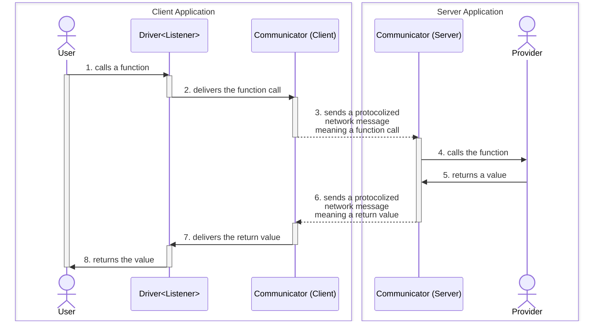

import { Callout, Tabs, Tab } from 'nextra-theme-docs'

## Outline
This chapter describes key components of the `TGrid` only in the conceptual level.

If you're not familar with theoretical stories, it's okay to skip to the next chapter [Features > WebSocket Protocol](./websocket).

Even you want to see the example codes, step to the [Learn from Examples > Remote Funtion Call](../examples/remote-function-call) chapter. 

Otherwise, let's study about the key components of the `TGrid`.

  - [`Communicator`](#communicator): network communication with remote system
  - [`Header`](#header): header value directly delivered after the connection
  - [`Provider`](#provider): object provided for remote system
  - [`Driver`](#driver): proxy instance for calling functions of the remote system's `Provider`


## Communicator


Communicates with a remote system.

`Communicator` is a class taking full responsibility to network communication with remote system. You can register a Provider, an object would be provided to the remote system, to the `Communicator`. Also, [`Driver<Remote>`](#driver), which can access to the remote system's [Provider](#provider), is created by this `Communicator`.

For reference, actual `Communicator` is the top-level abstract class, and all the classes responsible for network communication in `TGrid` are inheriting from this `Communicator` class. Here is the list of every communicator classes in `TGrid`.

Protocol | Client | Server
---------|--------|--------
Web Socket | [`WebSocketConnector`](./websocket/#websocketconnector) | [`WebSocketAcceptor`](./websocket/#websocketacceptor)
Dedicated Worker | [`WorkerConnector`](./worker/#workerconnector) | [`WorkerServer`](./worker/#workerserver)
Shared Worker | [`SharedWorkerConnector`](./worker/#sharedworkerconnector) | [`SharedWorkerAcceptor`](./worker/#sharedworkeracceptor)


## Header
<Tabs items={["Client Program", "WebSocket Server", "Worker Server"]}>
  <Tab>
```typescript filename="examples/websocket/src/client.ts" showLineNumbers {18}
import { Driver, WebSocketConnector } from "tgrid";

import { ICalcConfig } from "./interfaces/ICalcConfig";
import { ICalcEvent } from "./interfaces/ICalcEvent";
import { ICalcEventListener } from "./interfaces/ICalcEventListener";
import { ICompositeCalculator } from "./interfaces/ICompositeCalculator";

export const webSocketClientMain = async () => {
  const stack: ICalcEvent[] = [];
  const listener: ICalcEventListener = {
    on: (evt: ICalcEvent) => stack.push(evt),
  };
  const connector: WebSocketConnector<
    ICalcConfig,
    ICalcEventListener,
    ICompositeCalculator
  > = new WebSocketConnector(
    { precision: 2 }, // header
    listener, // provider for remote server
  );
  await connector.connect("ws://127.0.0.1:37000/composite");

  const remote: Driver<ICompositeCalculator> = connector.getDriver();
  console.log(
    await driver.plus(10, 20), // returns 30
    await driver.multiplies(3, 4), // returns 12
    await driver.divides(5, 3), // returns 1.67
    await driver.scientific.sqrt(2), // returns 1.41
    await driver.statistics.mean(1, 3, 9), // returns 4.33
  );

  await connector.close();
  console.log(stack);
};
```
  </Tab>
  <Tab>
```typescript filename="examples/websocket/src/server.ts" showLineNumbers {21}
import { Driver, WebSocketServer } from "tgrid";

import { ICalcConfig } from "./interfaces/ICalcConfig";
import { ICalcEventListener } from "./interfaces/ICalcEventListener";
import { CompositeCalculator } from "./providers/CompositeCalculator";
import { ScientificCalculator } from "./providers/ScientificCalculator";
import { SimpleCalculator } from "./providers/SimpleCalculator";
import { StatisticsCalculator } from "./providers/StatisticsCalculator";

export const webSocketServerMain = async () => {
  const server: WebSocketServer<
    ICalcConfig,
    | CompositeCalculator
    | SimpleCalculator
    | StatisticsCalculator
    | ScientificCalculator,
    ICalcEventListener
  > = new WebSocketServer();
  await server.open(37_000, async (acceptor) => {
    // LIST UP PROPERTIES
    const config: ICalcConfig = acceptor.header;
    const listener: Driver<ICalcEventListener> = acceptor.getDriver();

    // ACCEPT OR REJECT
    if (acceptor.path === "/composite")
      await acceptor.accept(new CompositeCalculator(config, listener));
    else if (acceptor.path === "/simple")
      await acceptor.accept(new SimpleCalculator(config, listener));
    else if (acceptor.path === "/statistics")
      await acceptor.accept(new StatisticsCalculator(config, listener));
    else if (acceptor.path === "/scientific")
      await acceptor.accept(new ScientificCalculator(config, listener));
    else {
      await acceptor.reject(1002, `WebSocket API endpoint not found.`);
      return;
    }

    // PING REPEATEDLY TO KEEP CONNECTION
    acceptor.ping(15_000);
  });
  return server;
};
```
  </Tab>
  <Tab>
```typescript filename="examples/worker/src/server.ts" showLineNumbers {14}
import { Driver, WorkerServer } from "tgrid";

import { ICalcConfig } from "./interfaces/ICalcConfig";
import { ICalcEventListener } from "./interfaces/ICalcEventListener";
import { CompositeCalculator } from "./providers/CompositeCalculator";

const main = async () => {
  const server: WorkerServer<
    ICalcConfig,
    CompositeCalculator,
    ICalcEventListener
  > = new WorkerServer();

  const header: ICalcConfig = await server.getHeader();
  const listener: Driver<ICalcEventListener> = server.getDriver();
  const provider: CompositeCalculator = new CompositeCalculator(
    header,
    listener,
  );
  await server.open(provider);
};
main().catch((exp) => {
  console.error(exp);
  process.exit(-1);
});
```
  </Tab>
</Tabs>

Header value delivered after the connection.

`Header` is a value, delivered from client to server directly, after the connection.

Server can get the `Header` value through acceptor's `header` property.

  - [`WebSocketAcceptor.header`](/api/classes/WebSocketAcceptor-1.html#header-1)
  - [`SharedWorkerAcceptor.header`](/api/classes/SharedWorkerAcceptor-1.html#header-1)
  - [`WorkerServer.getHeader()`](/api/classes/WorkerServer-1.html#getHeader)


## Provider
```typescript filename="examples/websocket/src/server.ts" showLineNumbers {26, 28, 30, 32}
import { Driver, WebSocketServer } from "tgrid";

import { ICalcConfig } from "./interfaces/ICalcConfig";
import { ICalcEventListener } from "./interfaces/ICalcEventListener";
import { CompositeCalculator } from "./providers/CompositeCalculator";
import { ScientificCalculator } from "./providers/ScientificCalculator";
import { SimpleCalculator } from "./providers/SimpleCalculator";
import { StatisticsCalculator } from "./providers/StatisticsCalculator";

export const webSocketServerMain = async () => {
  const server: WebSocketServer<
    ICalcConfig,
    | CompositeCalculator
    | SimpleCalculator
    | StatisticsCalculator
    | ScientificCalculator,
    ICalcEventListener
  > = new WebSocketServer();
  await server.open(37_000, async (acceptor) => {
    // LIST UP PROPERTIES
    const config: ICalcConfig = acceptor.header;
    const listener: Driver<ICalcEventListener> = acceptor.getDriver();

    // ACCEPT OR REJECT
    if (acceptor.path === "/composite")
      await acceptor.accept(new CompositeCalculator(config, listener));
    else if (acceptor.path === "/simple")
      await acceptor.accept(new SimpleCalculator(config, listener));
    else if (acceptor.path === "/statistics")
      await acceptor.accept(new StatisticsCalculator(config, listener));
    else if (acceptor.path === "/scientific")
      await acceptor.accept(new ScientificCalculator(config, listener));
    else {
      await acceptor.reject(1002, `WebSocket API endpoint not found.`);
      return;
    }

    // PING REPEATEDLY TO KEEP CONNECTION
    acceptor.ping(15_000);
  });
  return server;
};
```

Object provided for remote system.

`Provider` is an object provided for the remote system.

The remote system can call the `Provider`'s functions through [`Driver<Remote>`](#driver).


## Driver
```typescript filename="examples/websocket/src/client.ts" showLineNumbers {23-30}
import { Driver, WebSocketConnector } from "tgrid";

import { ICalcConfig } from "./interfaces/ICalcConfig";
import { ICalcEvent } from "./interfaces/ICalcEvent";
import { ICalcEventListener } from "./interfaces/ICalcEventListener";
import { ICompositeCalculator } from "./interfaces/ICompositeCalculator";

export const webSocketClientMain = async () => {
  const stack: ICalcEvent[] = [];
  const listener: ICalcEventListener = {
    on: (evt: ICalcEvent) => stack.push(evt),
  };
  const connector: WebSocketConnector<
    ICalcConfig,
    ICalcEventListener,
    ICompositeCalculator
  > = new WebSocketConnector(
    { precision: 2 }, // header
    listener, // provider for remote server
  );
  await connector.connect("ws://127.0.0.1:37000/composite");

  const remote: Driver<ICompositeCalculator> = connector.getDriver();
  console.log(
    await driver.plus(10, 20), // returns 30
    await driver.multiplies(3, 4), // returns 12
    await driver.divides(5, 3), // returns 1.67
    await driver.scientific.sqrt(2), // returns 1.41
    await driver.statistics.mean(1, 3, 9), // returns 4.33
  );

  await connector.close();
  console.log(stack);
};
```

> ```bash filename="Terminal"
> $ npm start
> 30 12 1.67 1.41 4.33
> [
>   { type: 'plus', input: [ 10, 20 ], output: 30 },
>   { type: 'multiplies', input: [ 3, 4 ], output: 12 },
>   { type: 'divides', input: [ 5, 3 ], output: 1.67 },
>   { type: 'sqrt', input: [ 2 ], output: 1.41 },
>   { type: 'mean', input: [ 1, 3, 9 ], output: 4.33 }
> ]
> ```

Driver of RPC (Remote Procedure Call).

`Driver` is a proxy instance designed to call functions of the remote system. It has a generic argument `Remote` which means the type of remote system's [Provider](#provider), and you can remotely call the functions of the [Provider](#provider) asynchronously through the `Drive<Remote>` instance.

When you call some function of remote [Provider](#provider) by the `Driver<Listener>` instance, it hooks the function call expression, and delivers the function name and arguments (parameter values) to the remote system through the [Communicator](#communicator). If the remote system suceeded to reply the result of the function call, [Communicator](#communicator) resolves the promise of the function call expression with the result, so that makes `Driver<Remote>` working.

Otherwise exception is thrown in the remote [Provider](#provider) function, [Communicator](#communicator) deliveries the exception instance instead to the remote system, so that actual exception being thrown from the `Driver<Remote>` instance.

<Callout type="info" emoji="💻"> 
**Demonstration**

You can run it on [Playground Website](https://stackblitz.com/~/github.com/samchon/tgrid.example.websocket?file=src/client.ts&view=editor), or local machine.

```bash filename="Terminal" copy
git clone https://github.com/samchon/tgrid.example.websocket
npm install
npm start
```
</Callout>